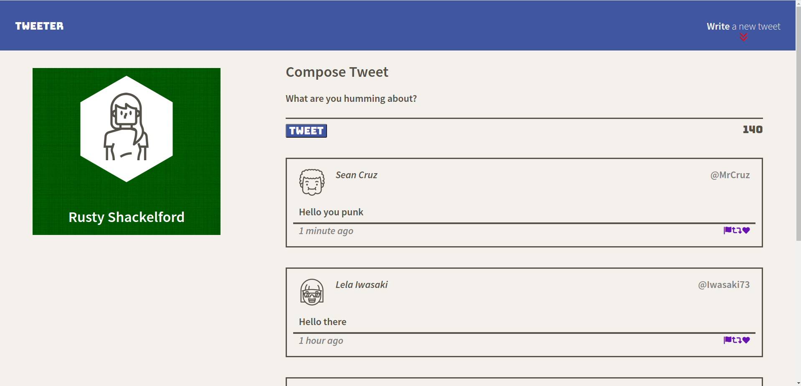
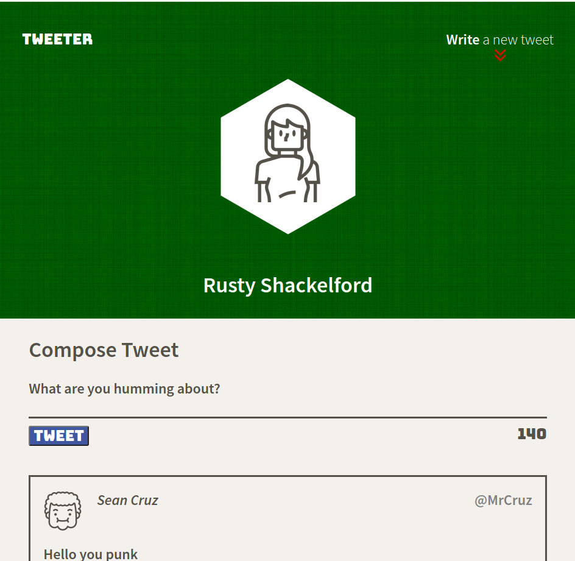
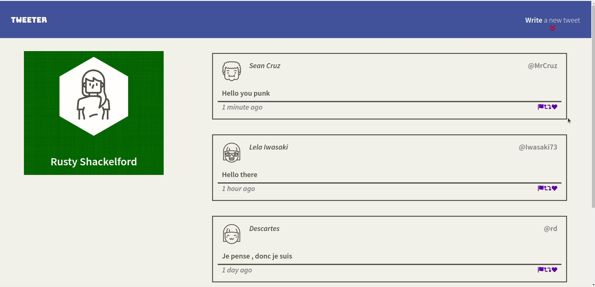

# Tweeter Project

Tweeter is a simple, single-page responsive Twitter clone. 

The app gives the user the ability to post tweets to a feed. The app uses Javascript, jQuery and AJAX on the front end, express and node on the back end (developed by lighthouse). 

## Core Functionality
- Write in a tweet box and "submit" the tweet to the backend using AJAX
- Upon successful POST request, GET the tweet object data back from the back end and update the feed
- The app must be single page
- App is responsive

### Stretch Functionality
- Added a CSS animation to the nav bar button when hovering over the element
- Added jQuery functionlity to collapse/expand tweet submission form
- Added a pop-up button which triggers on scrolling and will guide to the tweet form upon clicking
- Added a close button on my error pop-ups in case you wish to close the warning at any time

# Final Product

## Getting Started

1. Install dependencies using the `npm install` command.
2. Start the web server using the `npm run local` command. The app will be served at <http://localhost:8080/>.
3. Go to <http://localhost:8080/> in your browser.

## Dependencies

- Express
- Node 5.10.x or above
- nodemon
- chance
- md5
